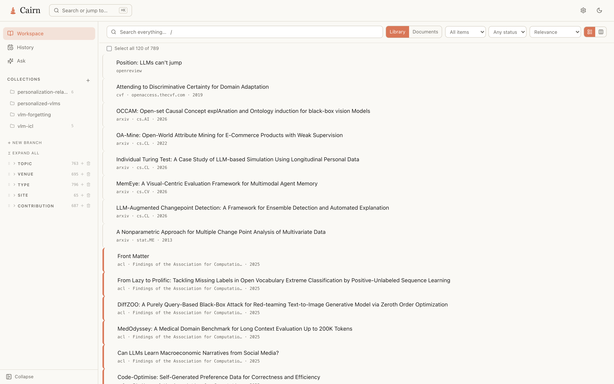
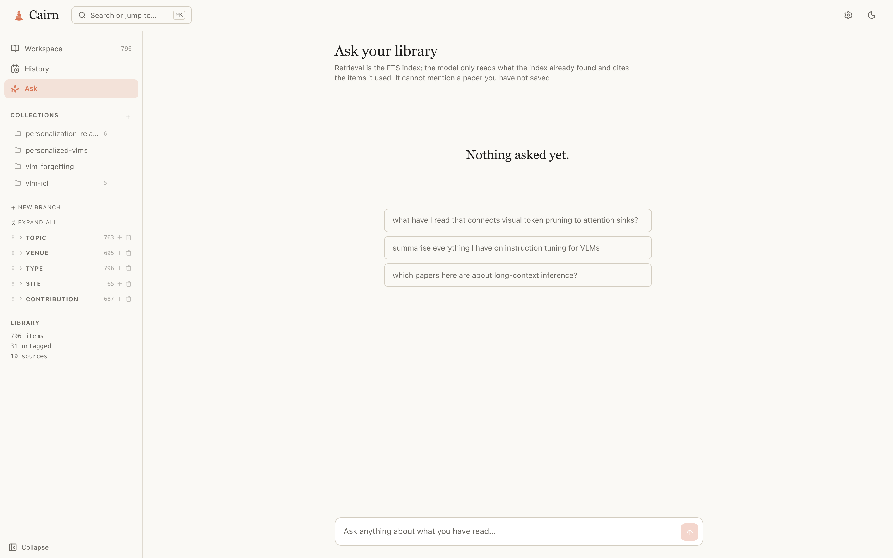
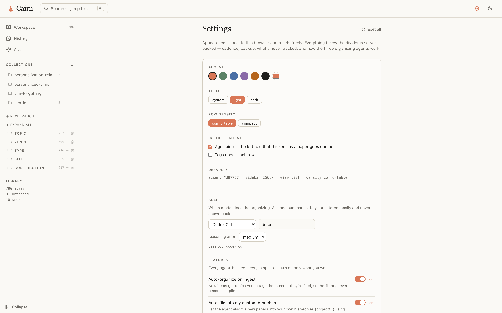

# Cairn

**The research library that organizes itself.**

You open a dozen papers, mean to come back to them, and never find them again. Cairn
turns the papers and pages you read in Chrome into a library you'll actually return to:
save a tab and it's filed — automatically — into a topic hierarchy that grows with your
reading. No manual tagging, no bookmark graveyard.

Find any paper in a keystroke with full-text search, or **ask your library** in plain
language and get answers drawn *only* from what you've saved — with citations, never
made up. Pull clean BibTeX when it's time to write. And it all runs on your own Mac:
no account, no cloud, nothing uploaded, ever.



## What it does

- **Capture** the front Chrome tab with a global hotkey, or ingest every open tab
  at once.
- **Organize** automatically into a deep tag hierarchy (topic first; add method,
  task or your own facets) using a model backend you choose — or none.
- **Re-find** instantly — relevance-ranked full-text search, collections, and an
  **Ask your library** chat grounded only in what you've actually saved.
- **Cite** — export a whole collection or branch as one `.bib`. BibTeX is *extracted*
  from the published source (CrossRef, DBLP, ACL, arXiv), preferring the conference or
  journal entry over the preprint — never fabricated; anything unresolvable is listed,
  not invented.
- **Tidy** — merge duplicate captures, keep a `docs` bucket for working documents
  separate from your reading library.



## Requirements

- macOS — capturing open Chrome tabs uses AppleScript automation
- Python 3.10+
- Node 18+ (only to build the web UI)
- Google Chrome
- Optional: an API key for Claude or OpenAI, or a local Ollama / Codex CLI — only
  needed for automatic organizing, summaries, and "Ask your library" (see First run)

## Install & run

```bash
git clone https://github.com/Sshanu/Cairn.git
cd Cairn
./install.sh
```

That's it. `install.sh` creates the Python environment, builds the web UI, and starts
the background agents that keep Cairn live at **http://localhost:8765**. It's safe to
re-run. Requires **Python 3.10+** and **Node 18+**.

<details>
<summary>Prefer to run the steps yourself?</summary>

```bash
python3 -m venv .venv && source .venv/bin/activate
pip install -e ".[api,extract,web]"      # extras: API, metadata extraction, web UI
cd ui && npm install && npm run build && cd ..
tt serve --port 8765                      # foreground; or `tt autostart` for the background agents
```
</details>

**First run — choose how it organizes.** Open **Settings → Agent** and pick a model
backend: **Claude** (Anthropic), **OpenAI**, a local **Ollama** model, the **Codex** CLI,
or **None**. With *None*, capture, full-text search, and manual tagging all work — a
backend is only needed for automatic tag hierarchies, summaries, and "Ask your library".
Keys are stored locally in `~/.cairn/config.json`, never shown back, and never leave your
machine.

The database lives at `~/.cairn/cairn.db` (created on first run). Back it up by copying
that file.

## Use it as a desktop app

Cairn ships a web-app manifest, so you can install the page as a standalone Chrome app —
its own window and Dock icon, no address bar. It still runs entirely on your machine
against `localhost:8765`; installing just gives it an app-like frame.

In **Chrome**, open **http://localhost:8765**, then click the **install icon** at the
right of the address bar (or **⋮ menu → Cast, save, and share → Install page as app…**).
Confirm, and *Cairn* opens in its own window with the cairn icon.

**Pair it with the extension.** For the full experience, also add the Chrome extension
(see [Saving tabs](#saving-tabs)) — the app is where you browse, search and ask; the
extension is how papers get *in*. Press **⌘⇧E** on any tab to save the page you're
reading straight into a collection or topic, without leaving it.

Keep the server running (see [Run it in the background](#run-it-in-the-background))
so the app opens instantly every time.

## Saving tabs

```bash
tt save              # save the current front Chrome tab
tt ingest            # pull in every open tab
```

To save from anywhere with a keyboard shortcut, install the Chrome extension in
[`extension/`](extension/) — open *chrome://extensions*, turn on **Developer mode**, and
**Load unpacked** that folder. Then press **⌘⇧E** on any tab to file it into a collection
or topic. Rebind the key at *chrome://extensions/shortcuts*.

## How organizing works

Cairn organizes your library with **three agents, run in order** — and every
prompt is shown and editable in **Settings → Organization**, so nothing is hidden:

1. **Tag-proposal** — reads titles + abstracts in clustered batches of ~50 and
   proposes a flat pool of candidate concepts across the whole library.
2. **Hierarchy** — turns that pool into a clean tree, one facet at a time: tight
   top-level breadth (10–15 areas), deep nesting below.
3. **Tagging** — tags each item into the tree, per item, in batches of ~10 and
   multi-label. It may grow the vocabulary when an item genuinely doesn't fit.

Batches are formed by clustering offline sentence embeddings (model2vec — no
network, no GPU), so similar items are proposed and tagged together.

**Two steps with a review checkpoint.** From Settings you run:

- **1 · Build hierarchy** — erases the current topic/method/task tags, then
  proposes concepts and builds the tree. It does *not* tag items yet, so you can
  review the new hierarchy in the sidebar first.
- **2 · Tag everything** — tags every item into the reviewed hierarchy.

New items captured day-to-day are tagged incrementally into the existing tree
(when *auto-organize* is on), so the library never becomes a pile.

### Prompts, standing rules, and facets

- **Three prompts** (tag-proposal, hierarchy, tagging) are each editable with a
  **Reset to default** button.
- **Standing rules** are the house style applied on top of all three prompts —
  organize by *subject not tools*, few-and-precise tags, ≥3 items per tag, group
  by research problem not modality, grow the tree to fit. Editable and resettable.
- **Facets** are the independent hierarchies to build — `topic` by default; add
  `method`, `task`, `contribution`, or your own.

### Computed vs. agent tags

Some tags are derived purely from the URL and are **never** written by a model:

- `type/` (paper, preprint, blog, code, dataset, …), `venue/` (arxiv, acl, …) and
  `site/` (for non-papers) are **computed from the URL**.
- The agent only assigns the model facets: `topic/ method/ task/ contribution/`.
- `project/` branches are your own manual filing (optionally auto-filed by the
  agent if you enable it).

## Settings

Everything a default relies on is visible and resettable — full transparency:



- **Agent** — which model does organizing, Ask and summaries: Claude (Anthropic),
  OpenAI, a local **Ollama** model, the **Codex** CLI, or **None** (search and
  manual tagging still work fully). Keys are stored locally and never shown back.
- **Features** — each agent-backed nicety is opt-in: auto-organize on ingest,
  auto-file into your custom branches, auto-summary + "why you saved this",
  related-in-your-library, weekly digest, and pause tracking.
- **Cadence** — how often open tabs are filed, and how often the ledger ticks.
- **Backup** — to iCloud Drive, a folder, or a git repo, on a schedule.
- **Never track these domains** — your own blocklist, shown on top of the built-in
  list (video, news, sport, social, chat assistants, local/private hosts).
- **Save-tab hotkey** — the Chrome extension in [`extension/`](extension/) (⌘⇧E);
  rebind at *chrome://extensions/shortcuts*.
- **Appearance** — accent, light/dark/system theme, and row density (local to the
  browser, resets freely).

## Run it in the background

`install.sh` already sets up launchd agents that keep the server, tab poller, autosave
and backups running. They're set to **restart on their own**: the server relaunches at
login after a reboot (`RunAtLoad`) and restarts itself if it ever crashes (`KeepAlive`),
so Cairn is just always there at localhost:8765 — nothing to start by hand. Manage them
any time with:

```bash
tt autostart            # (re)install the background agents
tt autostart --remove   # stop and remove them
```

## Development

Only needed if you want to modify Cairn itself — not for everyday use. The web UI is a
Vite + React app; run it with hot-reload against the running backend:

```bash
cd ui
npm run dev      # Vite dev server with hot reload (proxies /api to :8765)
npx tsc -b       # typecheck
```

## License

[MIT](LICENSE) — use, modify, and distribute freely; just keep the copyright notice.
Your library, keys, and data stay on your machine; nothing is uploaded anywhere.

---

Built with FastAPI + SQLite on the backend and Vite + React + Tailwind on the
front end.
